<!-- Header -->
<picture>
  <source media="(prefers-color-scheme: dark)" srcset="assets/header-dark.svg">
  <source media="(prefers-color-scheme: light)" srcset="assets/header-light.svg">
  
</picture>

<!-- Profile Views -->

  

<!-- Typing SVG -->

  

<!-- Social Links -->

  &nbsp;
  &nbsp;
  &nbsp;
  &nbsp;
  

 

 

<!-- Tech Stack -->
## `> tech_stack`

  

 

<!-- Featured Projects -->
## `> featured_projects`

  &nbsp;&nbsp;
  

  &nbsp;&nbsp;
  

  

 

<!-- GitHub Stats -->
## `> github_stats`

  &nbsp;&nbsp;
  

  

 

<!-- Contribution Snake -->
## `> contributions`

<picture>
  <source media="(prefers-color-scheme: dark)" srcset="https://raw.githubusercontent.com/zerotwo02255/zerotwo02255/output/github-snake-dark.svg">
  <source media="(prefers-color-scheme: light)" srcset="https://raw.githubusercontent.com/zerotwo02255/zerotwo02255/output/github-snake.svg">
  
</picture>

 

<!-- Activity Graph -->

  

 

<!-- Footer -->
<picture>
  <source media="(prefers-color-scheme: dark)" srcset="assets/footer-dark.svg">
  <source media="(prefers-color-scheme: light)" srcset="assets/footer-light.svg">
  
</picture>
